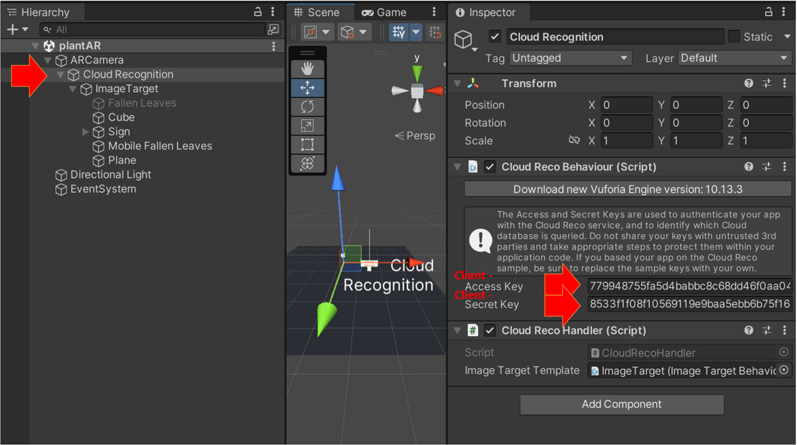

# AR Plantrecognition

## Change Database

1. Open `Cloud Recognition` element in the scene hierachy. 
2. Change the `Client Access Key` and `Client Secret Key`. 
3. Use the coresspondig server keys for the image-uploader tool.

## Setup

Here are the steps you can follow to create a local Unity project by cloning a Git repository:

1. Install Git on your computer: If you don't have Git installed, you can download it from the official Git website.

2. Clone the repository: Open a terminal window or Git Bash and navigate to the folder where you want to store the Unity project. Then, run the following command to clone the repository:

        git pull git@github.com:chriscasa95/treeAR.git

3. Open Unity Hub: Launch Unity Hub and click on the "Projects" button in the left-side menu.

4. Import the project: Click on the "Add" button and select the folder where you cloned the repository. Unity Hub should automatically recognize it as a Unity project and import it.

5. Open the project: After the import is complete, you can double-click on the project to open it in the Unity Editor.

Note: Before cloning a Git repository, it's important to check if the repository contains any assets that are subject to copyright or other restrictions. If you use assets in your project that you don't have the right to use, you could face legal consequences.

### Add Vuforia package

Copy the file `com.ptc.vuforia.engine-x.x.x.tgz` into `./Packages/` folder.

Replace x.x.x with the desired version number.

### Open Scene

1. In the Unity Editor, click on the "File" menu and select "Open Scene".

2. Navigate to the `Scenes` folder.

3. Select the scene file and click "Open". The scene file should have the .unity extension.

The project should now work as expected.